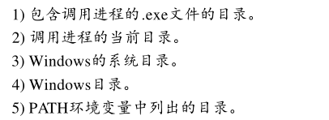

# 进程

## define

进程通常被定义为一个正在运行的程序的实例，它由两个部分组成。
- 一个是操作系统用来管理进程的内核对象 -> 存放进程相关信息
- 另一个是地址空间，它包含所有可执行模块或 DLL 模块的代码和数据 -> 具体代码数据

进程是不活泼的。若要使进程完成某项操作，它必须拥有一个在它的环境中运行的线程。

该线程负责执行包含在进程的地址空间中的代码

> 当创建一个进程时，系统会自动创建它的第一个线程，称为主线程。然后，该线程可以创建其他的线程，而这些线程又能创建更多的线程。

若要使所有这些线程都能运行，操作系统就要为每个线程安排一定的 CPU 时间。

- 名词: GUI & CUI
  - GUI还是CUI: 存在一个链接程序开关，/SUBSYSTEM:windows/console

## Windows程序运行

启动函数->调用点函数(main)->点函数返回->exit

- 启动函数: 负责对c/c++运行期间库进行初始化。(malloc,free)

  - 检索指向新进程的完整命令行的指针
  - 检索指向新进程的环境变量的指针
  - 对C/C++运行期的全局变量进行初始化。如果包含了stdlib.h文件，代码就能访问这些变
    量。
  - 对C运行期内存单元分配函数（ malloc 和 calloc）和其他低层输入/输出例程使用的内存栈
    进行初始化。

  当所有这些初始化操作完成后， C/C + +启动函数就调用应用程序的进入点函数

- main函数写法和对应的启动函数。

- 点函数返回->C运行期间exit函数，返回nMainRetVal
  - Exit函数
    - 调用由_onexit函数的调用而注册的任何函数
    - 为所有全局的和静态的C + +类对象调用析构函数
    - 调用操作系统的ExitProcess函数，将nMainRetVal传递给它

### 进程的实例句柄

- 创建一个进程：

加载到进程地址空间的每个可执行文件或 DLL文件均被赋予一个独一无二的实例句柄。

可执行文件的实例作为wWinMain的**第一个参数**hinstExe来传递。对于加载资源的函数调用来说，通常都需要该句柄的值。（实际为可执行文件的映象加载到进程的地址空间时使用的基本地址空间）

Visual C++链接程序使用的默认基地址是 0x0040 0000，因为这是在运行Windows98时可执行文件的映象可以加载到的最低地址。

使用Microsoft的链接程序中的/BASE:address 链接程序开关可以更改默认基地址。

- **HMODULE GetModuleHandle(PCTSTR pszModule) **获得句柄/基地址
  - GetModuleHandle("rundll32.dll")
  - 只查看调用进程的地址空间
  - 传null参数返回可执行文件基地址。

- 上面main函数第二个参数为进程的前一个实例句柄，通常为null

- 第三个参数是cmdline
  - GetCommandLine(): 返回一个指向包含完整命令行的缓存的指针
- ...

## CreateProcess

可以用CreateProcess函数创建一个进程：

1. 当一个线程调用CreateProcess时，系统就会创建一个进程内核对象，其初始使用计数是 1。这个内核对象用来统计进程信息。

2. 然后，系统为新进程创建一个虚拟地址空间，并将可执行文件或任何必要的 DLL文件的代码和数据加载到该进程的地址空间中。
3. 然后，系统为新进程的主线程创建一个线程内核对象（其使用计数为 1）统计线程信息的小型数据结构
4. 执行 C/C + +运行期启动代码，该主线程便开始运行，它最终调用点函数
5. 如果系统成功地创建了新进程和主线程，CreateProcess便返回TRUE

参数:

- pszApplicationName:可执行文件的名字 一般为NULL

- pszCommandLine : CommandLine 最好传一个字符串指针进去

  - 可以使用pszCommandLine参数设定一个完整的命令行，以便 CreateProcess用来创建新进程.这样CreateProcess会自动查看cmdline的第一个标记，把它当作可执行文件的名字，自动补后缀.exe

  - 搜索文件路径

    - 

    > 劫持？

- psaProcess：设定进程的安全对象

- psaThread: 设定线程的安全对象

  - 可为NULL，会设为默认的安全描述符
  - 也可指定SECURITY_ATTRIBUTES结构体

- bInheritHandles：BOOL，标志句柄是否可以继承

- fdwCreate：用于标识标志，以便用于规定如何来创建新进程

- pvEnvironment ： 用于指向包含新进程将要使用的环境字符串的内存块，可为NULL，默认继承父进程

- pszCurDir ： 允许父进程设置子进程的当前驱动器和目录

  - 如果本参数是 NULL，则新进程的工作目录将与生成新进程的应用程序的目录相同
  - 如果本参数不是 NULL，那么pszCurDir必须指向包含需要的工作驱动器和工作目录的以 0结尾的字符串。

- psiStartInfo 用于指向一个STARTUPINFO结构，新建进程的初始化信息（GUI位置，标题等）
  - cb为该结构体大小	
  - 将该结构的未用成员设置为零
  - dwFlags用来标志其他成员是否有用
  - 查看父进程的STARTINFO信息 :void  GetStartupInfo(LPSTARTUPINFO pStartupInfo) ; 对cb初始化为size

   

- ppiProcInfo : 指向一个PROCESS_INFORMATION 结构体。

  - 返回进程和线程内核对象句柄（通过CloseHandle来关闭）
  - 返回进程id和线程id
    - 进程id和线程id拥有相同的号码池，所以线程和进程的id也不会重复
    - id可以复用
    - 

  
